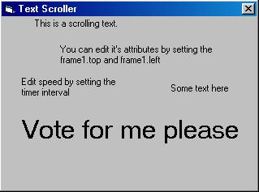



## \[Aurora Borealis\] Text scroller

### Description

This is the easiest way to make text scroll.

At least that's what I think. Just sit down

and let the timer do all the working for you...

Paste your text on the frame and it will automaticly scroll on application start :D Belive me, this works just as good or perhaps even better than a lot of other submission I've seen here...

Remember to vote please...
 
### More Info
 

             |
---                |---
**Submitted On**   |2002-04-27 20:51:02
**By**             |[Arcanix](https://github.com/Planet-Source-Code/PSCIndex/blob/master/ByAuthor/arcanix.md)
**Level**          |Beginner
**User Rating**    |4.0 (44 globes from 11 users)
**Compatibility**  |VB 5\.0, VB 6\.0
**Category**       |[Coding Standards](https://github.com/Planet-Source-Code/PSCIndex/blob/master/ByCategory/coding-standards__1-43.md)
**World**          |[Visual Basic](https://github.com/Planet-Source-Code/PSCIndex/blob/master/ByWorld/visual-basic.md)
**Archive File**   |[Homarid\_\_T765234272002\.zip](https://github.com/Planet-Source-Code/arcanix-aurora-borealis-text-scroller__1-34172/archive/master.zip)

